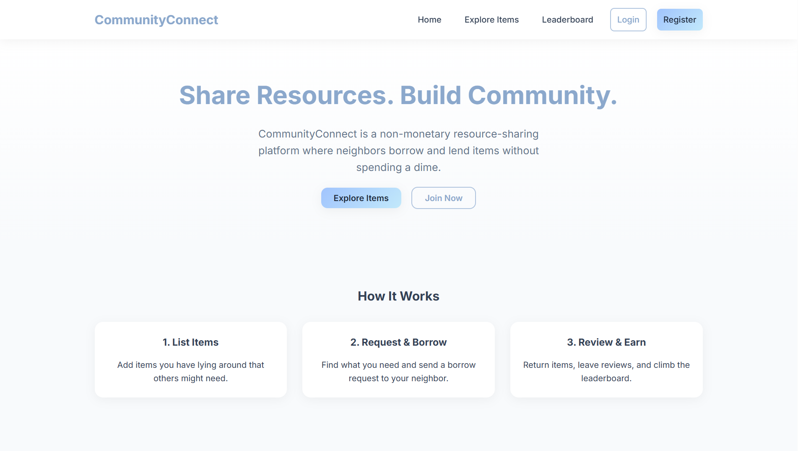
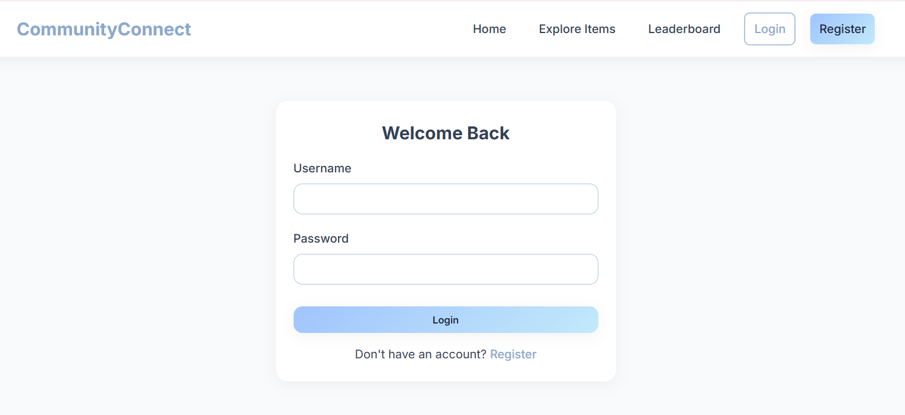
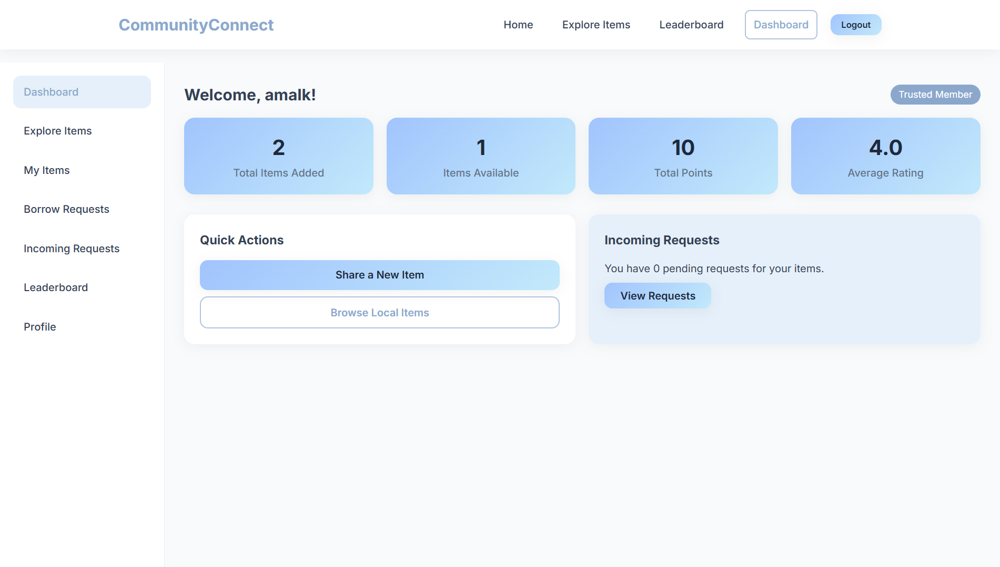
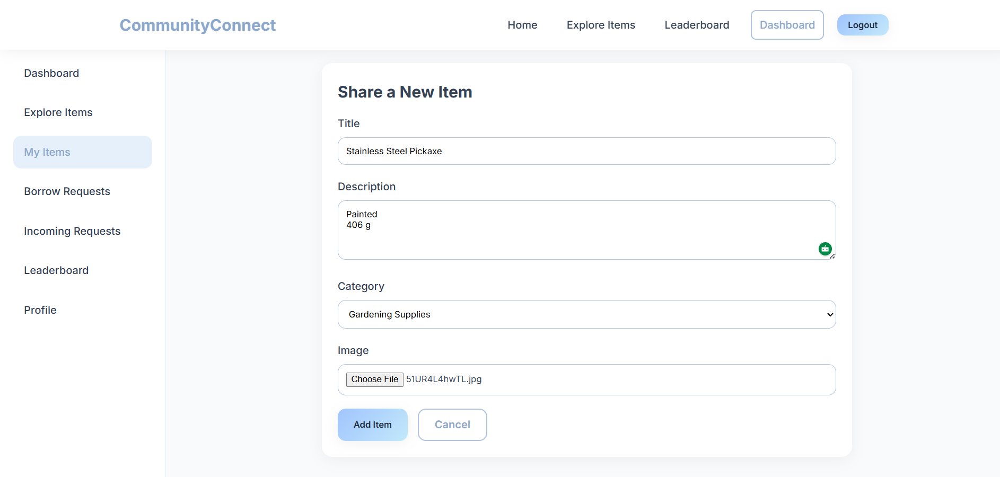
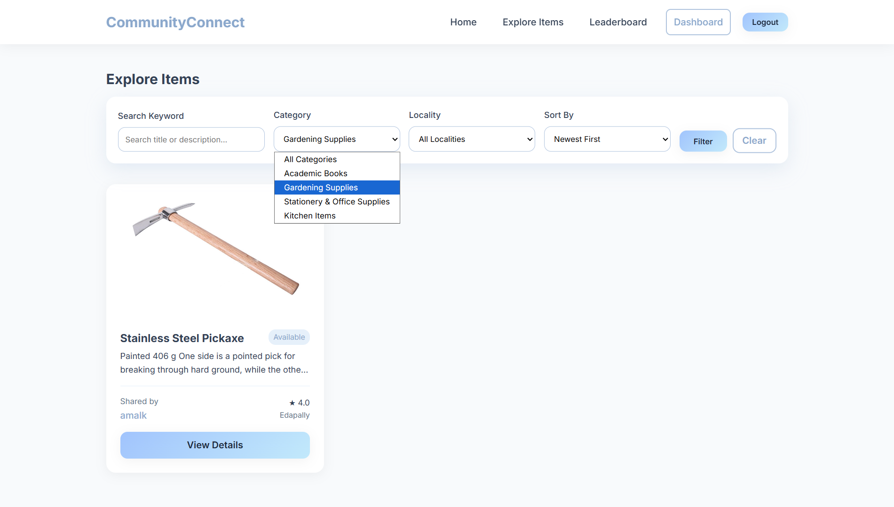
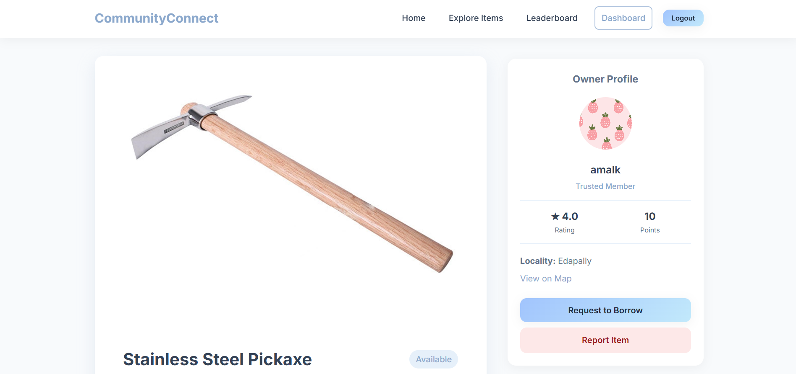
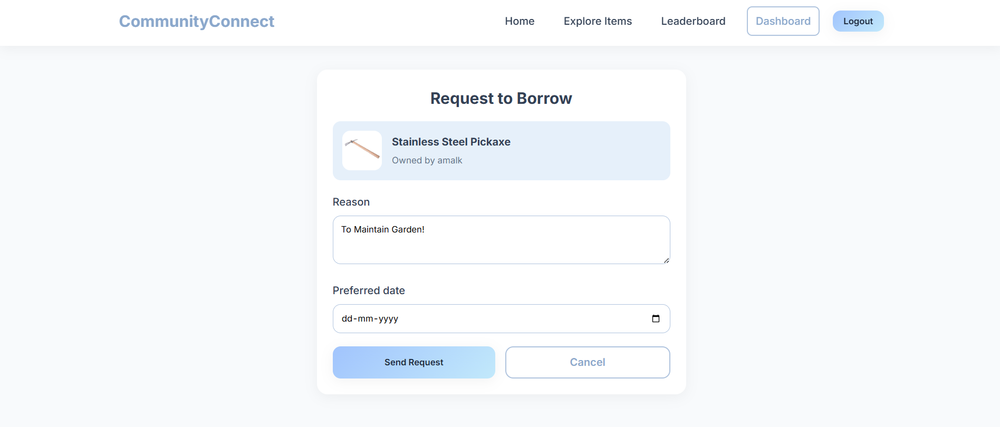
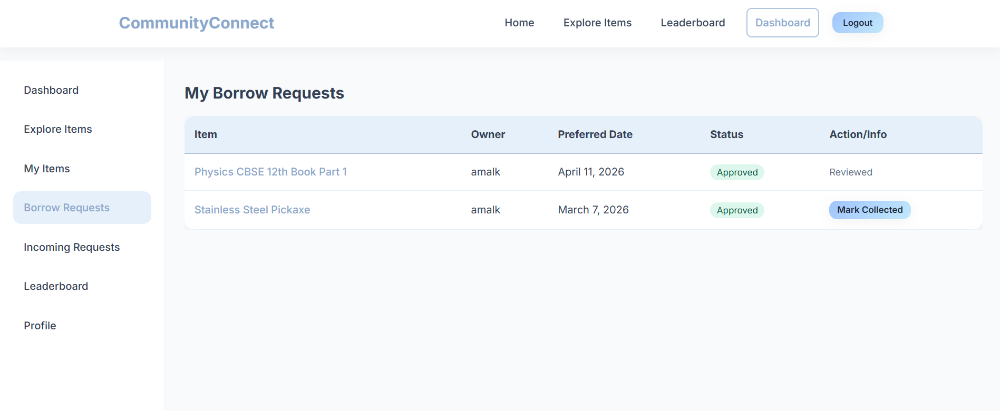
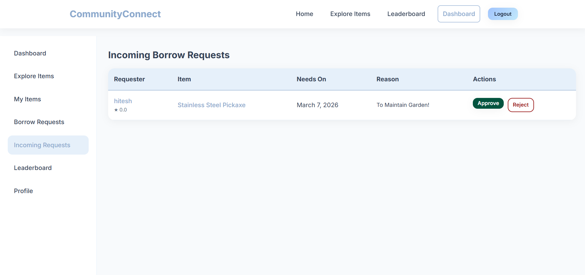
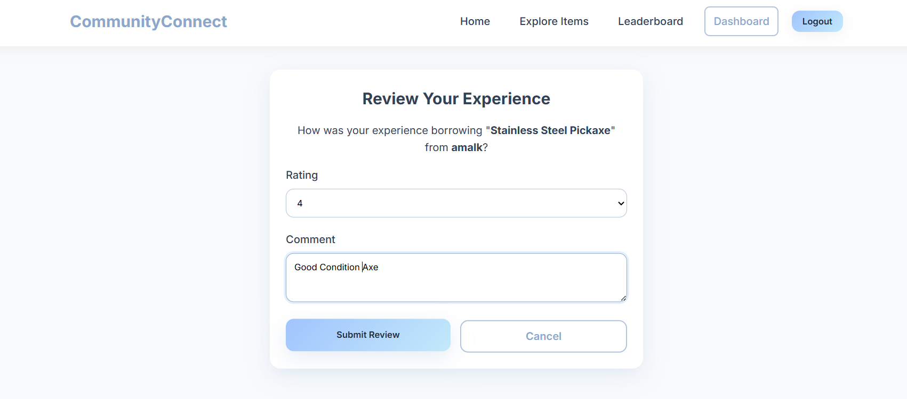

# CommunityConnect – Resource Sharing Platform


CommunityConnect is a locality-based, non-monetary resource sharing platform that enables users to lend and borrow items within their community. The system focuses on sustainability, trust, and efficient utilization of resources by eliminating monetary transactions and introducing a transparent request and rating workflow.

---

## Key Highlights

- Community-driven platform (no payments involved)
- Clean and modern UI with responsive design
- Role-based access (Admin & Member)
- Full CRUD operations using Django ORM
- Trust system via ratings, reviews, and leaderboard
- Real-world workflow implementation (request → approve → collect → review)

---

## Features

- User registration and authentication  
- Add, edit, and manage items  
- Borrow request system with approval/rejection  
- Status tracking (Pending, Approved, Closed)  
- Mark items as collected  
- Review and rating system  
- Leaderboard (Top contributors)  
- Locality-based search and filtering  
- Report item functionality  
- Admin dashboard for system control  

---

## Modules

### Member
- Dashboard overview
- Explore items with filters
- Add / edit items
- Borrow requests (sent)
- Incoming requests (received)
- Profile management
- Leaderboard access

### Admin
- Dashboard with system statistics
- Category management
- User management (block/unblock)
- View all items
- Monitor borrow records
- Review moderation
- Leaderboard monitoring

---

## Tech Stack

- Backend: Django
- Database: SQLite
- Frontend: HTML, CSS
- Template Engine: Django Templates

---

## Project Structure
```
CommunityConnect/
│
├── CommunityConnect/ # Project settings
├── member/ # Main application (models, views, forms)
├── templates/ # HTML templates
├── static/css/ # Stylesheets
├── media/ # Uploaded media files
├── manage.py
└── .gitignore
```

---

## Screenshots












---

## Installation

```bash
git clone https://github.com/mariajose-dev/CommunityConnect-Resource-Sharing-Platform.git
cd CommunityConnect-Resource-Sharing-Platform

python -m venv venv
venv\Scripts\activate   # Windows

pip install -r requirements.txt

python manage.py migrate
python manage.py runserver
```
## Usage
- Register as a member
- Add items to share
- Explore items shared by others
- Send borrow requests
-Approve or reject incoming requests
-Mark items as collected
-Submit reviews and ratings
-Earn points and appear on leaderboard

## Notes
- No payment system is involved
- Designed for community/local usage
- Focuses on trust, sharing, and sustainability

## Future Improvements
- Notification system
- Real-time chat between users
- Location-based recommendations
- Image optimization
- Deployment (AWS / Render)

## Author
Maria Jose
